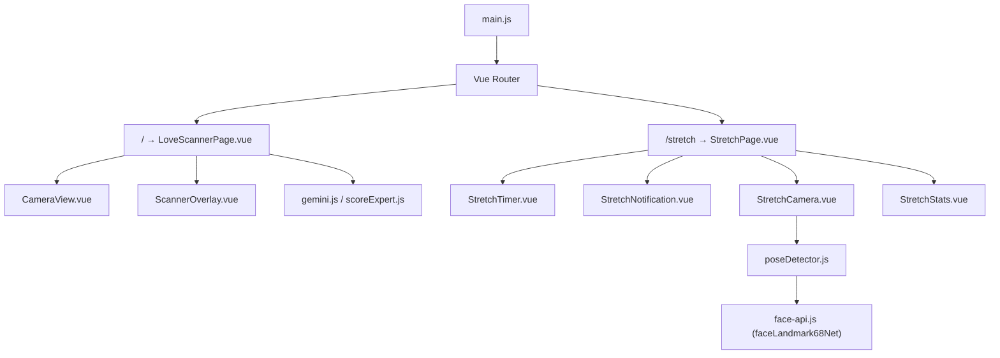
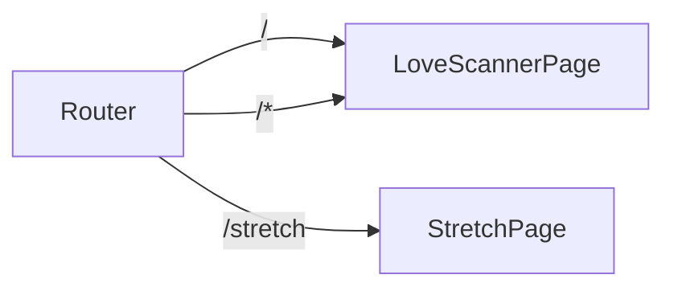
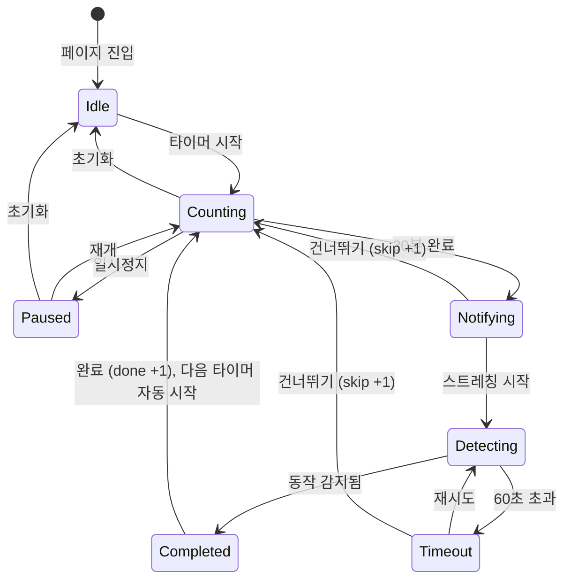

# 기술 설계: 스트레칭 리마인더

## 개요

기존 러브 스캐너 앱(Vue 3 + Vite SPA)에 스트레칭 리마인더 기능을 추가한다. Vue Router를 도입하여 `/` (러브 스캐너)와 `/stretch` (스트레칭 리마인더)를 분리하고, 30분 간격 타이머, 전체 화면 오버레이 알림, 카메라 기반 동작 감지, 세션 기록 기능을 구현한다.

### 핵심 설계 결정

1. **Vue Router 도입**: `vue-router`를 추가하여 SPA 라우팅 구현. 기존 `App.vue`의 러브 스캐너 로직을 `LoveScannerPage.vue`로 추출하고, `App.vue`는 `<router-view>`만 렌더링하는 셸로 변환한다.
2. **face-api.js 재활용**: 기존 `@vladmandic/face-api`의 `faceLandmark68Net` 모델을 활용하여 스트레칭 동작 감지. 별도 포즈 감지 라이브러리 없이 얼굴 랜드마크(코, 턱, 눈) 위치 변화로 상체 움직임을 추정한다.
3. **페이지 세션 기반 기록**: `ref()` 반응형 상태로만 관리하여 페이지 이탈/새로고침 시 자동 초기화. localStorage 불필요.
4. **카메라 리소스 독립 관리**: 각 페이지 컴포넌트가 `onMounted`/`onUnmounted`에서 카메라 스트림을 독립적으로 시작/정리하여 충돌 방지.

## 아키텍처

### 전체 구조



### 라우팅 구조



### 스트레칭 세션 흐름



## 컴포넌트 및 인터페이스

### 신규/변경 파일 목록

| 파일 | 유형 | 설명 |
|------|------|------|
| `src/router/index.js` | 신규 | Vue Router 설정 |
| `src/main.js` | 변경 | Router 등록 |
| `src/App.vue` | 변경 | `<router-view>` 셸로 변환 |
| `src/pages/LoveScannerPage.vue` | 신규 | 기존 App.vue 러브 스캐너 로직 추출 |
| `src/pages/StretchPage.vue` | 신규 | 스트레칭 리마인더 메인 페이지 |
| `src/components/StretchTimer.vue` | 신규 | 타이머 표시 및 제어 UI |
| `src/components/StretchNotification.vue` | 신규 | 전체 화면 오버레이 알림 |
| `src/components/StretchCamera.vue` | 신규 | 스트레칭 감지용 카메라 뷰 |
| `src/components/StretchStats.vue` | 신규 | 세션 통계 표시 |
| `src/services/poseDetector.js` | 신규 | 얼굴 랜드마크 기반 동작 감지 로직 |
| `vercel.json` | 변경 | SPA 리다이렉트 설정 추가 |

### 컴포넌트 인터페이스

#### `StretchPage.vue` (페이지 컨테이너)

```
상태:
  - timerState: 'idle' | 'counting' | 'paused' | 'notifying' | 'detecting' | 'completed' | 'timeout'
  - remainingSeconds: number (0~1800)
  - currentStretch: { type: 'neck' | 'shoulder' | 'waist', instruction: string }
  - stats: { done: number, skipped: number }

이벤트 흐름:
  StretchTimer → start/pause/resume/reset
  StretchNotification → startDetection/skip
  StretchCamera → stretchDetected/timeout
```

#### `StretchTimer.vue`

```
Props:
  - state: 'idle' | 'counting' | 'paused'
  - remainingSeconds: number

Emits:
  - start
  - pause
  - resume
  - reset
```

#### `StretchNotification.vue`

```
Props:
  - visible: boolean
  - stretch: { type: string, instruction: string }

Emits:
  - start-stretch
  - skip
```

#### `StretchCamera.vue`

```
Props:
  - active: boolean

Emits:
  - stretch-detected
  - timeout
  - camera-denied

Expose:
  - progress: number (0~100)
```

#### `StretchStats.vue`

```
Props:
  - done: number
  - skipped: number
```

#### `poseDetector.js`

```javascript
/**
 * 기준 자세 대비 머리/어깨 위치 변화를 감지
 * @param {Array} baselineLandmarks - 감지 시작 시점의 68개 랜드마크
 * @param {Array} currentLandmarks - 현재 프레임의 68개 랜드마크
 * @returns {{ isStretching: boolean, confidence: number, direction: string }}
 */
export function detectStretchMovement(baselineLandmarks, currentLandmarks) { ... }

/**
 * 랜드마크 배열에서 머리 중심점 계산 (코 브릿지 + 턱 중심)
 * @param {Array} landmarks - 68개 랜드마크 좌표
 * @returns {{ x: number, y: number }}
 */
export function getHeadCenter(landmarks) { ... }

/**
 * 스트레칭 동작 판정 임계값
 */
export const STRETCH_THRESHOLD = 30; // 픽셀 단위 위치 변화 임계값
export const DETECTION_TIMEOUT = 60000; // 60초 타임아웃
```

## 데이터 모델

### 타이머 상태

```typescript
interface TimerState {
  status: 'idle' | 'counting' | 'paused';
  remainingSeconds: number;  // 0~1800 (30분)
  intervalId: number | null;
}
```

### 스트레칭 동작 정보

```typescript
interface StretchInfo {
  type: 'neck' | 'shoulder' | 'waist';
  instruction: string;  // 사용자에게 표시할 안내 텍스트
}

const STRETCH_EXERCISES: StretchInfo[] = [
  { type: 'neck', instruction: '고개를 천천히 좌우로 기울여 목을 풀어주세요' },
  { type: 'shoulder', instruction: '양 어깨를 귀 쪽으로 올렸다 내려주세요' },
  { type: 'waist', instruction: '상체를 좌우로 천천히 비틀어 허리를 풀어주세요' },
];
```

### 세션 기록

```typescript
interface SessionStats {
  done: number;     // 스트레칭 완료 횟수
  skipped: number;  // 건너뛰기 횟수
}
```

### 동작 감지 결과

```typescript
interface PoseDetectionResult {
  isStretching: boolean;
  confidence: number;    // 0~1
  direction: string;     // 'left' | 'right' | 'up' | 'down' | 'none'
}
```


## 정확성 속성 (Correctness Properties)

*속성(Property)은 시스템의 모든 유효한 실행에서 참이어야 하는 특성 또는 동작이다. 속성은 사람이 읽을 수 있는 명세와 기계가 검증할 수 있는 정확성 보장 사이의 다리 역할을 한다.*

### Property 1: 존재하지 않는 경로는 항상 루트로 리다이렉트

*For any* 라우터에 등록되지 않은 임의의 경로 문자열에 대해, 라우터는 항상 루트 경로(`/`)로 리다이렉트해야 한다.

**Validates: Requirements 1.3**

### Property 2: 시간 포맷팅 정확성

*For any* 0~1800 범위의 정수 초 값에 대해, 포맷팅 함수는 `MM:SS` 형식의 문자열을 반환해야 하며, 해당 문자열을 다시 초로 변환하면 원래 값과 동일해야 한다 (라운드트립).

**Validates: Requirements 2.2**

### Property 3: 타이머 일시정지/재개 라운드트립

*For any* 1~1800 범위의 남은 시간 값에서 타이머를 일시정지한 후 재개하면, 재개 시점의 남은 시간은 일시정지 시점의 남은 시간과 동일해야 한다.

**Validates: Requirements 2.4, 2.5**

### Property 4: 타이머 초기화 불변성

*For any* 타이머 상태(counting 또는 paused)와 임의의 남은 시간 값에서 초기화를 수행하면, 타이머 상태는 항상 `idle`이고 남은 시간은 항상 1800초여야 한다.

**Validates: Requirements 2.6**

### Property 5: 스트레칭 동작 선택 유효성

*For any* 스트레칭 알림 발생 시, 선택된 스트레칭 동작은 항상 유효한 타입(`neck`, `shoulder`, `waist`) 중 하나여야 하며, 해당 타입에 대응하는 안내 텍스트가 비어있지 않아야 한다.

**Validates: Requirements 3.2**

### Property 6: 동작 감지 임계값 판정

*For any* 기준 랜드마크와 현재 랜드마크 쌍에 대해, 머리 중심점의 유클리드 거리가 임계값(STRETCH_THRESHOLD) 이상이면 `isStretching`은 `true`를 반환하고, 미만이면 `false`를 반환해야 한다.

**Validates: Requirements 4.2**

### Property 7: 세션 기록 정확성

*For any* 완료(done)와 건너뛰기(skip) 이벤트의 임의 시퀀스에 대해, `stats.done + stats.skipped`는 항상 총 세션 이벤트 수와 동일해야 하며, 각 카운터는 해당 이벤트 타입의 발생 횟수와 정확히 일치해야 한다.

**Validates: Requirements 5.1**

## 에러 처리

| 상황 | 처리 방식 |
|------|-----------|
| 카메라 권한 거부 | 안내 메시지 표시 + 수동 완료 버튼 제공 (요구사항 4.6) |
| face-api 모델 로드 실패 | 로딩 오버레이 유지 + 콘솔 에러 로그 |
| 얼굴 감지 실패 (감지 모드 중) | 감지 루프 계속 진행, 60초 타임아웃 시 재시도/건너뛰기 옵션 |
| 존재하지 않는 라우트 접근 | 루트(`/`)로 리다이렉트 |
| 타이머 탭 비활성화 | `document.visibilitychange` 이벤트로 타이머 보정 (실제 경과 시간 기반) |

## 테스트 전략

### 단위 테스트 (Example-based)

- **라우터 설정**: `/` → LoveScannerPage, `/stretch` → StretchPage 매핑 확인
- **타이머 시작**: 시작 후 상태가 `counting`, 초기값 1800초 확인
- **알림 트리거**: remainingSeconds가 0일 때 `notifying` 상태 전환 확인
- **건너뛰기**: 건너뛰기 후 `counting` 상태 + 1800초 + `skipped` 증가 확인
- **스트레칭 완료**: 감지 완료 후 `completed` → `counting` 전환 + `done` 증가 확인
- **타임아웃**: 60초 경과 후 `timeout` 상태 전환 확인
- **카메라 권한 거부**: 안내 메시지 + 수동 완료 버튼 렌더링 확인

### 속성 기반 테스트 (Property-based)

테스트 라이브러리: **fast-check** (JavaScript/TypeScript PBT 라이브러리)

설정:
- 각 속성 테스트는 최소 100회 반복 실행
- 각 테스트에 설계 문서 속성 참조 태그 포함
- 태그 형식: `Feature: stretch-reminder, Property {number}: {property_text}`

대상 속성:
- Property 1: 존재하지 않는 경로 리다이렉트 (라우터 resolve 함수 테스트)
- Property 2: 시간 포맷팅 라운드트립 (`formatTime` ↔ `parseTime`)
- Property 3: 타이머 일시정지/재개 라운드트립 (상태 머신 테스트)
- Property 4: 타이머 초기화 불변성 (상태 머신 테스트)
- Property 5: 스트레칭 동작 선택 유효성 (선택 함수 테스트)
- Property 6: 동작 감지 임계값 판정 (`detectStretchMovement` 순수 함수 테스트)
- Property 7: 세션 기록 정확성 (상태 관리 함수 테스트)

### 통합 테스트

- 러브 스캐너 기능 회귀 테스트 (기존 기능 보존 확인)
- 페이지 전환 시 카메라 리소스 정리 확인
- Vercel SPA 리다이렉트 설정 동작 확인
